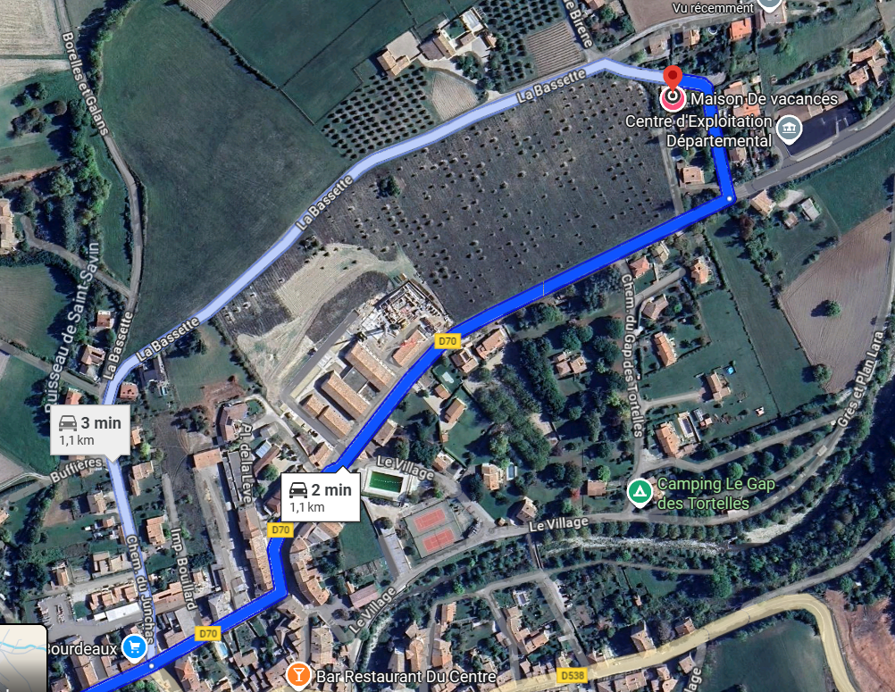

Bienvenue à Bourdeaux
=====================

Petit Guide pour:
-----------------
- [La Maison](#la-maison)
    - [Comment Nous Trouver?](#comment-nous-trouver)
    - [Guide Pratique](#guide-pratique)
- [Bourdeaux et les alentours](#bourdeaux)

La Maison
---------
Nous vous souhaitons un agréable séjour dans notre maison de vacances. 
Vous êtes ici dans notre petit paradis dans le pays de la lavande et du picodon.
Cette maison n'est donc pas un location anonyme mais un lieu rempli d'objets et de
souvenirs précieux que nous vous invitons à découvrir, partager, et respecter. 

### Comment Nous Trouver
> 85 Gré et Plan Lara  
> 26460 Bourdeaux  
> GPS: [44°35'01.4"N 5°08'23.8"E](https://www.google.com/maps/place/44%C2%B035'01.4%22N%205%C2%B008'23.8%22E)
/ ou "Gite Héspérides"  

Traverser le village de Bourdeaux, puis tourner à gauche dans le chemin "Plan Lara".
Notre maison est la dernière des trois maison à gauche, avec des volets violets.
Vous pouvez vous garer devant le garage ou sur le petit parking devant la maison si vous venez à plusieurs voitures.

 Maison" width="400" />

Vous trouvez une boite a clés à côté de la porte d’entrée:
> Code: 1707

***Merci de remettre la clé dans la boite quand vous partez.***

Bienvenue chez nous! :-)

### Contacts
En cas de toute questions, voici nos numéros de téléphone:
> **Ophélie**: 0679971362  
> **Julian**: 0786525568

### Guide Pratique

#### Les Poubelles
Les déchets sont à apporter aux points de collecte. Le plus proche se trouve en bas de la maison, à 200 m à gauche. 
Tout les containers sont en libre-service, sauf les déchets ménagers qui sont accessibles avec l'"Eco-Badge", 
que vous trouvez sur le comptoir de la cuisine. Merci de respecter le tri-sélectif:
> - **Le verre** : containers verre
> - **Les emballages (plastique, papier, métal, etc)** : containers avec couvercle jaune
> - **Le carton** : containers dédiées gros cartons
> - **Tout le reste** : dans les containers noirs, accès avec la carte "Eco-Badge" 

#### Machine à Laver
Vous pouvez vous servir de la machine à laver qui se trouve dans la petite salle de bain, a droite de la porte d’entrée. 

#### Internet
Cette maison a été pensée comme un lieu de déconnexion et du stress de la vie quotidienne.
Il n'y a donc ni télévision, ni box internet.

#### Chauffage/Climatisation
La maison est équipée d'une climatisation réversible, réglable par pièce, qui peut être utilisée pour le chauffage ou le refroidissement.
Vous trouverez dans chaque pièce une commande AirZone qui permet d'ajuster la température pour chaque pièce.

> N.B. La maison étant en pierre, elle garde bien la fraîcheur en journée et le climat de la région fait que
> la température descent généralement la nuit. 
> Nous vous conseillons donc en période d'été d’aérer la nuit ou le matin et fermer les volets des chambres en journée.

***Merci de vous assurer que la climatisation est éteinte dans chaque pièce à la fin de votre séjour!***

#### Poêle à bois
Vous trouverez tout ce qu'il faut pour allumer un feu (bois, briquet, etc.) autour du poêle dans le salon.
Merci de nettoyer le poêle en utilisant le sceau à cendres mis à disposition après utilisation.
 

> N.B. Pour votre sécurité, la maison est équipée d'un détecteur de fumée dans le couloir et d'un détecteur de monoxyde de carbone à code du poêle. 

#### Jacuzzi
Vous pouvez profiter du jacuzzi gonflable, qui se trouve derrière la maison. Il est équipé d'un système de chauffage, 
une fonction bulles, et de désinfection par UV.

Quelques règles à respecter:
> - Prendre une douche avant de vous baigner et utiliser les claquettes mises à disposition afin de maintenir la qualité de l'eau.
> - Couvrir le jacuzzi quand vous n’êtes pas en train de l'utiliser pour garder la chaleur éviter que des feuilles ou insectes tombent dans l'eau.
> - Ne pas manger ou boire.
> - Ne pas sauter sur les bords.
> - S'assurer que le flotteur est remis dans l'eau quand vous avez terminé. 
> - Éteindre le chauffage à la fin de votre séjour ou si vous ne comptez pas a utiliser le jacuzzi (attention la température monte de 1 - 2°C par heure).

Le filtre doit être changé environ une fois par semaine (ou plus si utilisation intensive). 
Vous trouvez des rechanges dans le placard de la chambre, il suffit d'enlever l'ancien filtre et remettre un nouveau. 
En cas de doute, n’hésitez pas à nous contacter.

#### Le Coin des Artistes
Vous trouvez dans la véranda la table rempli de toute sorte de matériel de peinture et autres activités manuelles de notre fille.
S'il y a des artistes en herbe parmi vous pouvez, bien sûr, en profiter et nous laisser un joli souvenir de votre passage! 

Il en va de même pour les différents instruments de musique.

Bourdeaux
---------
Bourdeaux est un village typique de la Drôme Provençale d'environ 600 habitants. 

### Le Commerces
#### Supermarchés
- Bourdeaux:
    - [**Le Panier Sympa**](https://maps.app.goo.gl/EqrTturNXiQ8TqSz9), Bourdeaux: Petite supérette de dépannage très sympa avec une bonne selection de vins et autres produits locaux.
Bons fruits et légumes si produits de saison. 
Fait également dépôt de pain, livre par une boulangerie locale, à mon avis de bien meilleur qualité que la [boulangerie](#boulangerie). 
    - [**Spar**](https://maps.app.goo.gl/568pY3p92VVH4JR98), Bourdeaux: Légèrement plus grand que le Panier Sympa. Bonne sélection de viandes de producteurs locaux. Fait également dépôt de pain. 
- Crest:
    - Vous y trouez des plus grands magasins avec un choix plus étendu et surtout des prix plus abordables (
        [**Aldi**](https://maps.app.goo.gl/rxXxKDK9VCeDLWm56), [**Intermarché**](https://maps.app.goo.gl/ARDkuCv3DmSMjWEQ7)),
    ainsi que d'autres commerces alimentaires de toute sorte (boucheries, boulangeries, crémerie, magasins bio, etc). Pensez-y 
    de faire les courses, et faire le plein sur le chemin si vous venez de la direction Lyon. 
- Dieulefit:
    - [**SuperU**](https://maps.app.goo.gl/XLRXyVzAeB1NPADS8): Bonne qualité en produits frais, y compris du poisson.
- Saou:
    - [**l’Epicerie de Saou**](https://maps.app.goo.gl/T99YTnvvvbCE6G3M7): Produits de très bon qualité mais cher. Bon sélection en produits asiatiques.

#### Boucheries
- [**Boucherie Sympa**](https://maps.app.goo.gl/4aKxAwTptPHVoiha8): Très bonne qualité de viandes et quelques plats prépares (traiteur).
- [**Troupeou**](https://maps.app.goo.gl/3qpidatSyubgfXZz8): A la sortie du village en direction Saou. Magasin de vente directe de producteurs avec viande de bonne qualité. 

#### Boulangerie
La boulangerie [**La Mie Temps**](https://maps.app.goo.gl/RsB2272H6GSj8gyZ6) offre des pains et viennoiseries correctes mais pas extraordinaires.

