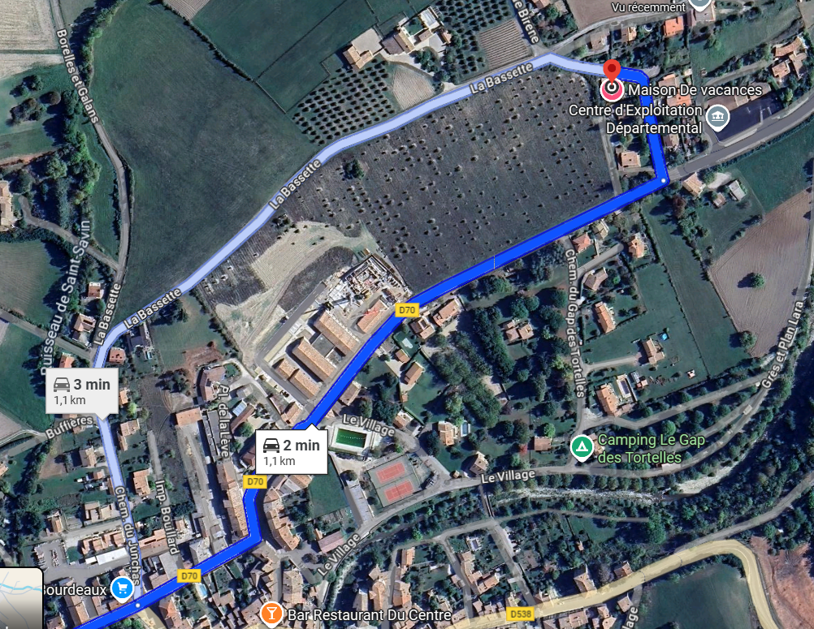

# Bienvenue à Bourdeaux

## Petit guide

- [La maison](#la-maison)
  - [Comment nous trouver ?](#comment-nous-trouver)
  - [Guide pratique](#guide-pratique)
- [Bourdeaux et les alentours](#bourdeaux)
  - [Commerces](#les-commerces)
  - [Coins de baignade](#baignade-en-rivière)

## La maison

Nous vous souhaitons un agréable séjour dans notre maison de vacances. Vous êtes ici dans notre petit paradis dans le pays de la lavande et du picodon. Cette maison n’est donc pas une location anonyme mais un lieu rempli d’objets et de souvenirs précieux que nous vous invitons à découvrir, partager et respecter.

### Comment nous trouver

> 85 Montée du Grès 
> Gîte Hespérides 
> 26460 Bourdeaux 
> GPS : [44°35’01.4”N 5°08’23.8”E](https://www.google.com/maps/place/44%C2%B035'01.4%22N%205%C2%B008'23.8%22E)

Traverser le village de Bourdeaux, puis tourner à gauche dans le chemin « Plan Lara ». Notre maison est la dernière des trois maisons à gauche, avec des volets violets. Vous pouvez vous garer devant le garage ou sur le petit parking devant la maison si vous venez à plusieurs voitures.

Vous trouvez une boîte à clés à côté de la porte d’entrée :

> **Code : 1707**

***Merci de remettre la clé dans la boîte quand vous partez.***

Bienvenue chez nous ! :-)

### Contacts

En cas de questions, voici nos numéros de téléphone :

> **Ophélie** : 06 79 97 13 62 
> **Julian** : 07 86 52 55 68

### Guide pratique

#### Les poubelles

Les déchets sont à apporter aux points de collecte. Le plus proche se trouve en bas de la maison, à 200 m à gauche. Tous les conteneurs sont en libre-service, sauf les déchets ménagers qui sont accessibles avec l’« Eco-Badge », que vous trouvez sur le comptoir de la cuisine. Merci de respecter le tri sélectif :

> - **Le verre** : conteneurs à verre
> - **Les emballages** (plastique, papier, métal, etc.) : conteneurs avec couvercle jaune
> - **Le carton** : conteneurs dédiés aux gros cartons
> - **Tout le reste** : dans les conteneurs noirs, accessibles avec la carte « Eco-Badge »

#### Machine à laver

Vous pouvez vous servir de la machine à laver qui se trouve dans la petite salle de bain, à droite de la porte d’entrée.

#### Internet

- **Identifiant** : `petit-paradis-de-bourdeaux`
- **Mot de passe** : `MonteDuGres85`

#### Chauffage et climatisation

La maison est équipée d’une climatisation réversible, réglable par pièce, qui peut être utilisée pour le chauffage ou le refroidissement. Vous trouverez dans chaque pièce une commande AirZone qui permet d’ajuster la température.

> **N.B.** La maison étant en pierre, elle garde bien la fraîcheur en journée et le climat de la région fait que la température descend généralement la nuit. Nous vous conseillons donc, en été, d’aérer la nuit ou le matin et de fermer les volets des chambres en journée.

***Merci de vous assurer que la climatisation est éteinte dans chaque pièce à la fin de votre séjour !***

#### Poêle à bois

Vous trouverez tout ce qu’il faut pour allumer un feu (bois, briquet, etc.) autour du poêle dans le salon. Merci de nettoyer le poêle en utilisant le seau à cendres mis à disposition après utilisation.

> **N.B.** Pour votre sécurité, la maison est équipée d’un détecteur de fumée dans le couloir et d’un détecteur de monoxyde de carbone à côté du poêle.

#### Jacuzzi

À partir du mois de juin, vous pouvez profiter du jacuzzi gonflable qui se trouve derrière la maison. Il est équipé d’un système de chauffage, d’une fonction bulles et d’un système de désinfection par UV.

Quelques règles à respecter :

> - Prendre une douche avant de vous baigner et utiliser les claquettes mises à disposition afin de maintenir la qualité de l’eau.
> - Couvrir le jacuzzi quand vous ne l’utilisez pas afin de garder la chaleur et d’éviter que des feuilles ou des insectes tombent dans l’eau.
> - Ne pas manger ou boire dans le jacuzzi.
> - Ne pas sauter sur les bords.
> - S’assurer que le flotteur est remis dans l’eau quand vous avez terminé.
> - Éteindre le chauffage à la fin de votre séjour ou si vous ne comptez pas utiliser le jacuzzi. Attention : la température monte de 1 à 2 °C par heure.

Le filtre doit être changé environ une fois par semaine, ou plus souvent en cas d’utilisation intensive. Vous trouvez des filtres de rechange dans le placard de la chambre : il suffit d’enlever l’ancien filtre et d’en remettre un nouveau. En cas de doute, n’hésitez pas à nous contacter.

#### Le coin des artistes

Vous trouvez dans la véranda une table remplie de toutes sortes de matériel de peinture et d’autres activités manuelles de notre fille. S’il y a des artistes en herbe parmi vous, vous pouvez bien sûr en profiter et nous laisser un joli souvenir de votre passage !

Il en va de même pour les différents instruments de musique.

## Bourdeaux

Bourdeaux est un charmant village de la Drôme provençale d’environ 600 habitants.

**Bourdeaux est le territoire de la transition entre le Vercors et la Provence. Le village se niche dans un magnifique panorama, à la croisée des routes de Crest, Dieulefit et Nyons, au sud de la [forêt de Saoû](https://www.dieulefit-tourisme.com/notre-destination/aux-alentours/la-foret-de-saou/) et de la chaîne montagneuse de Couspeau.**

Son histoire forte, empreinte de protestantisme, a façonné la commune et le caractère de ses habitants. Bourdeaux est une terre d’accueil traversée par les chemins de randonnée.

Un cadre exceptionnel donne au village sa douceur de vivre. Ses nombreux commerçants et artisans, ainsi qu’un tissu associatif dynamique et dense, offrent aux habitants comme aux visiteurs une qualité d’accueil très attractive.

### Les randonnées

Il est difficile de vous conseiller car il en existe beaucoup !

La plus célèbre est la randonnée des Trois Becs, qui vous permet de profiter d’un panorama exceptionnel sur la forêt de Saoû. Attention néanmoins, il faut compter environ six heures de marche.

Il existe évidemment de plus petites balades. Nous vous conseillons de consulter le site de [l’office de tourisme de Dieulefit-Bourdeaux](https://www.dieulefit-tourisme.com/votre-sejour/bouger-et-se-detendre/randonnee-pedestre/), qui propose des fiches de randonnée très bien faites.

Vous pouvez également vous rendre à l’office de tourisme de Bourdeaux :

> 7 place de l’Église 
> 26460 Bourdeaux 
> Tél. : 04 75 53 35 90 
> E-mail : <ot@dieulefit-tourisme.com>

**D’octobre à avril**

- Ouvert mardi, jeudi et samedi de 10 h à 12 h et de 14 h à 17 h.
- Fermé lundi, mercredi, dimanche et jours fériés.

**Mai, juin et septembre**

- Ouvert mardi, jeudi, vendredi et samedi de 10 h à 12 h et de 14 h à 18 h.
- Fermé lundi, mercredi, dimanche et jours fériés.

**Juillet et août**

- Ouvert lundi, mardi, jeudi, vendredi et samedi de 9 h 30 à 12 h 30 et de 15 h à 18 h 30.
- Fermé mercredi et dimanche.

### La piscine

La piscine publique est à 500 m de la maison, avec un grand bassin de nage ainsi qu’une pataugeoire pour les petits. Elle est ouverte de mi-juin à fin août, tous les jours sauf le lundi.

Horaires du 1er juillet au 31 août 2025 :

- Du mardi au samedi : 11 h-13 h et 15 h-19 h
- Lundi : fermé

### Baignade en rivière

Aller se rafraîchir dans l’un des nombreux coins de baignade est un vrai plaisir pour les grands comme pour les petits pendant les périodes de forte chaleur.

#### Le Gour du Saut

La baignade la plus proche se trouve à la sortie du village en direction de Saoû ([itinéraire](https://maps.app.goo.gl/dp5gH3oYhsEQxgEp8)). Garez-vous sur le parking à côté de la baraque à frites des [Frères Patates](https://www.facebook.com/LesFreresPatates), qui préparent d’excellents burgers et frites avec des produits locaux de qualité.

Pour la baignade, passez sous le pont à gauche du parking et continuez sur le chemin dans la forêt. Lorsque vous voyez la rivière, continuez vers la gauche sur environ 200 mètres. Vous trouverez de magnifiques trous d’eau pour vous rafraîchir et des mini-cascades qui font office de toboggans.

#### Pont-de-Barret

Ce coin de baignade, à 20 minutes en voiture de Bourdeaux, est assez fascinant ([itinéraire](https://maps.app.goo.gl/9m9JB6ybK8PkTCc67)). L’accès est simple : entrez dans le camping municipal à l’entrée de Pont-de-Barret — c’est autorisé — et suivez la rivière jusqu’aux petites marches en bois. Il y a deux cascades. Attention néanmoins : à partir du mois de juillet, l’eau peut se faire rare.

### Marchés alimentaires

- Marché hebdomadaire tous les jeudis matin de 8 h à 12 h 30.
- Le Cabas, marché paysan, de 17 h à 19 h devant l’Oustal.

### Les commerces

#### Supermarchés

- **Bourdeaux**
  - [**Le Panier Sympa**](https://maps.app.goo.gl/EqrTturNXiQ8TqSz9) : petite supérette de dépannage très sympathique, avec une bonne sélection de vins et d’autres produits locaux. Bons fruits et légumes lorsqu’ils sont de saison. Fait également dépôt de pain, livré par une boulangerie locale et, à notre avis, de bien meilleure qualité que celui de la boulangerie du village.
  - [**Spar**](https://maps.app.goo.gl/568pY3p92VVH4JR98) : légèrement plus grand que le Panier Sympa. Bonne sélection de viandes de producteurs locaux. Fait également dépôt de pain bio et local, qui est très bon.
- **Crest**
  - Vous y trouverez de plus grands magasins avec un choix plus étendu et surtout des prix plus abordables, notamment [**Aldi**](https://maps.app.goo.gl/rxXxKDK9VCeDLWm56) et [**Intermarché**](https://maps.app.goo.gl/ARDkuCv3DmSMjWEQ7), ainsi que d’autres commerces alimentaires de toutes sortes : boucheries, boulangeries, crémerie, magasins bio, etc. Pensez à faire les courses et le plein sur le chemin si vous venez de Lyon.
- **Dieulefit**
  - [**Super U**](https://maps.app.goo.gl/XLRXyVzAeB1NPADS8) : bonne qualité de produits frais, y compris le poisson.
- **Saoû**
  - [**L’Épicerie de Saoû**](https://maps.app.goo.gl/T99YTnvvvbCE6G3M7) : produits de très bonne qualité, mais chers. Bonne sélection de produits asiatiques.

#### Boucheries

- [**Boucherie Sympa**](https://maps.app.goo.gl/4aKxAwTptPHVoiha8) : viandes de bonne qualité et quelques plats préparés (traiteur).
- [**Troupeou**](https://maps.app.goo.gl/3qpidatSyubgfXZz8) : à la sortie du village en direction de Saoû. Magasin de vente directe de producteurs, avec de la viande de bonne qualité.

#### Boulangerie

[**La Mie Temps**](https://maps.app.goo.gl/RsB2272H6GSj8gyZ6) offre des pains et des viennoiseries corrects, mais pas extraordinaires.

### Bars et restaurants

- **Le Café de l’Univers** : il vient d’être repris par quatre jeunes très sympathiques et c’est le moins cher du village. Il leur arrive de proposer des plats traditionnels et abordables le soir. Le bar fait également bureau de tabac.
- **Le Bar du Centre** : comme son nom l’indique, il est au centre du village. Les consommations sont relativement chères, mais le cadre est agréable. Le bar fait aussi brasserie et la qualité est relativement bonne.
- **Le Petit Roubion** : restaurant et bar coopératif, dans un cadre très sympathique à côté du Roubion. Cuisine créative, de saison et locale. Des événements, concerts et spectacles y sont souvent organisés le week-end.
- **Le Magasin Général** : café et restaurant familial et convivial, avec une petite restauration à base de produits locaux, bio et frais, cuisinés maison.

À 15 minutes en voiture :

**La Fontaine Minérale** 
1210 route de Crest 
26160 Pont-de-Barret

C’est un endroit assez magique dans un grand parc au bord du Roubion. En été, des grillades sont proposées dans le parc. C’est également un lieu qui propose de nombreux événements et festivités.

<https://lafontaineminerale.fr/>

### Que faire dans la région ?

Nous consultons régulièrement [Les Échos de Couspeau](https://www.les-echos-de-couspeau.fr/evenements/mois/) afin de connaître les événements locaux en cours. N’hésitez pas à vous rendre aux différentes propositions : les soirées au Magasin Général et au Petit Roubion sont souvent très sympathiques !

Pour un périmètre plus large, consultez également [l’agenda de la Drôme provençale](https://www.dromeprovencale.fr/agenda/tout-lagenda/).
